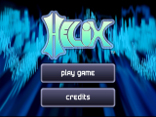

## projectM - The most advanced open-source music visualizer
projectM is an open-source project that reimplements the esteemed [Winamp Milkdrop](https://en.wikipedia.org/wiki/MilkDrop) by Geiss in a more modern, cross-platform reusable library.

Its purpose in life is to read in audio input and produce mesmerizing visuals, detecting tempo, and rendering advanced equations into a limitless array of user-contributed visualizations.

### Available For
* [Mac OS X iTunes (plugin)](https://github.com/projectM-visualizer/projectm/releases)
* [Android](https://play.google.com/store/apps/details?id=com.psperl.projectM)
* [iOS](https://itunes.apple.com/us/app/projectm-music-visualizer/id530922227?mt=8&ign-mpt=uo%3D4)
* [ALSA, Qt, xmms, winamp, jack, pulseaudio](https://sourceforge.net/projects/projectm/files/)

### Presets
The preset files define the visualizations via pixel shaders and Milkdrop-style equations and parameters. Included with projectM are the bltc201, Milkdrop 1 and 2, projectM, tryptonaut and yin collections. You can grab all of the presets [here](http://spiegelmc.com.s3.amazonaws.com/pub/projectm_presets.zip).

### Also Featured In
* [Kodi (formerly XBMC) ](https://kodi.tv/)
* [Helix ](http://ghostfiregames.com/helixhome.html)

***

## Screenshots


***

# Building From Source

## Mac OS X
* [Prebuilt iTunes plugin installer](https://github.com/projectM-visualizer/projectm/releases)
* [OSX Build instructions](BUILDING_OSX.txt)

## Linux
* `sudo apt-get install cmake-curses-gui libsdl2-dev libglew-dev libftgl-dev libsdl2-dev`

## Building From Source
Requires [cmake](https://cmake.org/download/).  
```
cmake .
make
make install
```

## Configure With cmake
If you wish to configure build options run:  
`ccmake .`  
This will present you with a simple console-based interface of options for projectM.  
Review the options and change what you think is necessary. Press 'g' to generate the make files and exit.  

***

## Help
Report issues on [GitHub](https://github.com/projectM-visualizer/projectm/issues/new)

## Authors
[Authors](AUTHORS.txt)  
If you would like to help improve this project, either with documentation, code, porting, hardware or anything else please let us know! We gladly accept pull requests and issues. 

## License
[LGPL](LICENSE.txt)
