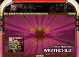

.. toctree::
   :maxdepth: 3

   self
   building
   emscripten
   llvm
   api/library_root

|Windows Build Status| |Linux Build Status| |macOS Build Status|
|Emscripten Build Status| |Android Build Status|

|Discord Shield| `Chat with us on
Discord <https://discord.gg/mMrxAqaa3W>`__

.. figure:: https://github.com/projectM-visualizer/projectm/raw/master/web/logo.png
   :alt: Logo

   Logo

projectM - The most advanced open-source music visualizer
---------------------------------------------------------

**Experience psychedelic and mesmerizing visuals by transforming music
into equations that render into a limitless array of user-contributed
visualizations.**

projectM is an open-source project that reimplements the esteemed
`Winamp Milkdrop <https://en.wikipedia.org/wiki/MilkDrop>`__ by Geiss in
a more modern, cross-platform reusable library.

Its purpose in life is to read an audio input and to produce mesmerizing
visuals, detecting tempo, and rendering advanced equations into a
limitless array of user-contributed visualizations.

Important: This repository only contains libprojectM for use in application development!
~~~~~~~~~~~~~~~~~~~~~~~~~~~~~~~~~~~~~~~~~~~~~~~~~~~~~~~~~~~~~~~~~~~~~~~~~~~~~~~~~~~~~~~~

This repository now only contains the projectM shared/static library.
All frontends, plug-ins and other tools were outsourced into separate
repositories. If you’re not a developer and just look for a download to
run projectM visuals on your machine or device, please use one of the
links listed below. The releases section in this repository only
contains source-code and binary releases of the projectM development
libraries and headers, which aren’t useful for end users.

End-User Applications
~~~~~~~~~~~~~~~~~~~~~

**Important**: projectM is currently undergoing heavy development, so
the available end-user frontends are either outdated or unavailable.
We’ve released a few development previews, which are not
feature-complete and may have bugs. As soon as we’ve finished the
current modernization of libprojectM, we’ll release new and tested
versions of most of the frontends listed below, while we may remove or
replace some of those which are no longer maintained by their original
developers.

Windows
^^^^^^^

-  Standalone (currently only available as a `development
   preview <https://github.com/kblaschke/frontend-sdl2/releases/tag/2.0-windows-pre1>`__)
-  `Steam <https://store.steampowered.com/app/1358800/projectM_Music_Visualizer/>`__
   (Same as standalone development preview)
-  `Windows Store <https://www.microsoft.com/store/apps/9NDCVH0VCWJN>`__
   (Old 3.1.12 release )

macOS
^^^^^

-  Standalone (currently only available as a `development
   preview <https://github.com/kblaschke/frontend-sdl2/releases/tag/2.0-macos-pre1>`__)
-  `Steam <https://store.steampowered.com/app/1358800/projectM_Music_Visualizer/>`__
   (Old 3.1.12 release)
-  Music.app Plugin (currently only available as an *unsigned*
   `development
   preview <https://github.com/kblaschke/frontend-music-plug-in/releases/tag/v3.0-pre1>`__)
-  `Brew <https://formulae.brew.sh/formula/projectm>`__ (Old 3.1.12
   release)

Linux
^^^^^

-  Standalone (currently only available as a `development
   preview <https://github.com/kblaschke/frontend-sdl2/releases/tag/2.0-linux-pre1>`__
   for Ubuntu 22.04 and compatible distributions)
-  `Steam <https://store.steampowered.com/app/1358800/projectM_Music_Visualizer/>`__
   (Same as standalone development preview)

Or check your distribution’s package manager for a binary release. If it
is outdated, please contact the package maintainer, as the projectM
development team does not maintain any of the distribution-specific
packages.

Android
^^^^^^^

-  `Google
   Play <https://play.google.com/store/apps/details?id=com.psperl.prjM>`__

**Note**: Both the free and paid apps plus the Android TV app are *not*
created or supported by the projectM developers! If you have technical
troubles or other inquiries, please contact the app author via the means
provided in the Play Store. Any bug reports in the projectM issue
tracker regarding the apps will be closed immediately.

Xbox / Windows Phone
^^^^^^^^^^^^^^^^^^^^

-  `Windows Store <https://www.microsoft.com/store/apps/9NDCVH0VCWJN>`__
   (Old 3.1.12 release)

Other
^^^^^

Source code and other resources, mostly aimed at developers.

-  `Library source
   code <https://github.com/projectM-visualizer/projectm/>`__ (this
   repository)
-  `Qt5 <https://www.qt.io/>`__ based
   `PulseAudio <https://www.freedesktop.org/wiki/Software/PulseAudio/>`__
   and JACK desktop apps `as source code for
   Linux <https://github.com/projectM-visualizer/frontend-qt>`__,
   currently broken and needs some updating (help wanted!).
-  `ALSA, XMMS, Winamp,
   JACK <https://sourceforge.net/projects/projectm/files/>`__ (legacy
   2.x sources for historic purposes, unmaintained since 2012)

Discord chat
~~~~~~~~~~~~

`Chat with us on Discord! <https://discord.gg/mMrxAqaa3W>`__

Demo Video
~~~~~~~~~~

|image6|

Presets
~~~~~~~

The preset files define the visualizations via pixel shaders and
Milkdrop-style equations and parameters.

The projectM library does not ship with any presets. The frontends come
with varying preset packs which can be found in separate repositories in
the projectM repository list:

-  `Base Milkdrop texture
   pack <https://github.com/projectM-visualizer/presets-milkdrop-texture-pack>`__
   - Recommended for use with *any* preset pack!
-  `Cream of the Crop
   Pack <https://github.com/projectM-visualizer/presets-cream-of-the-crop>`__
   - A collection of about 10K presets compiled by Jason Fletcher.
   Currently, projectM’s default preset pack.
-  `Classic projectM
   Presets <https://github.com/projectM-visualizer/presets-projectm-classic>`__
   - A bit over 4K presets shipped with previous versions of projectM.
-  `Milkdrop 2
   Presets <https://github.com/projectM-visualizer/presets-milkdrop-original>`__
   - The original preset collection shipped with Milkdrop and Winamp.
-  `En D
   Presets <https://github.com/projectM-visualizer/presets-en-d>`__ -
   About 50 presets created by “En D”.

Included with projectM are the bltc201, Milkdrop 1 and 2, projectM,
tryptonaut and yin collections. You can grab these presets
`here <http://spiegelmc.com/pub/projectm_presets.zip>`__.

You can also download an enormous 41,000 preset pack of presets
`here <https://mischa.lol/projectM/presets_community.zip>`__ (123MB
zipped).

Also Featured In
~~~~~~~~~~~~~~~~

`|Kodi| Kodi (formerly XBMC) <https://kodi.tv/>`__

`|Helix|
Helix <https://web.archive.org/web/20180628174410/http://ghostfiregames.com/helixhome.html>`__

`|Silverjuke| Silverjuke (FOSS Jukebox) <https://www.silverjuke.net>`__

`|VLC Media Player| VLC Media Player (AKA VideoLAN
Client) <https://www.videolan.org/vlc/>`__

Reminder: These are all third-party integrations of libprojectM and not
developed or supported by the projectM development team. Please report
bugs in those applications to their respective developers.

Screenshots
-----------

.. figure:: web/projectM_screenshots/Screen\ Shot\ 2014-08-25\ at\ 12.31.20\ AM.png
   :alt: Screenshot

   Screenshot

.. figure:: web/projectM_screenshots/Screen\ Shot\ 2014-08-25\ at\ 12.33.50\ AM.png
   :alt: Screenshot

   Screenshot

.. figure:: web/projectM_screenshots/Screen\ Shot\ 2014-07-18\ at\ 2.14.41\ PM.png
   :alt: Screenshot

   Screenshot

.. figure:: web/projectM_screenshots/Screen\ Shot\ 2014-07-18\ at\ 2.13.53\ PM.png
   :alt: Screenshot

   Screenshot

.. figure:: web/projectM_screenshots/Screen\ Shot\ 2014-07-18\ at\ 2.15.36\ PM.png
   :alt: Screenshot

   Screenshot

.. figure:: web/projectM_screenshots/Screen\ Shot\ 2014-08-16\ at\ 4.49.32\ PM.png
   :alt: Screenshot

   Screenshot

.. figure:: web/projectM_screenshots/Screen\ Shot\ 2014-08-16\ at\ 4.50.37\ PM.png
   :alt: Screenshot

   Screenshot

.. figure:: web/projectM_screenshots/Screen\ Shot\ 2014-08-25\ at\ 12.31.07\ AM.png
   :alt: Screenshot

   Screenshot

Architecture
------------

-  `Article <https://lwn.net/Articles/750152/>`__

Building from source
--------------------

See `BUILDING.md <BUILDING.md>`__ and the `developer documentation in
the
wiki <https://github.com/projectM-visualizer/projectm/wiki/Building-libprojectM>`__.

Using the library
-----------------

At its core projectM is a library, `libprojectM <src/libprojectM>`__.
This library is responsible for parsing presets, analyzing audio PCM
data with beat detection and FFT, applying the preset to the audio
feature data and rendering the resulting output with OpenGL. It can
render to a dedicated OpenGL context or a texture.

To get started using projectM in your own projects, please go to the
wiki and read the `developer
documentation <https://github.com/projectM-visualizer/projectm/wiki#integrating-projectm-into-applications>`__
available there.

There are some open-source applications that make use of libprojectM
which can be found in the `projectM organization’s
repositories <https://github.com/projectM-visualizer>`__ and elsewhere.

Todo
----

-  Improve projectM using the recently-released Milkdrop source (WIP).
-  Update the various implementations using libprojectM.
-  Update downstream projects with new versions.

Help
----

Report issues on GitHub in the respective repositories:

-  `Rendering issues, crashes or the libprojectM
   core/API <https://github.com/projectM-visualizer/projectm/issues>`__
-  `Standalone SDL
   app <https://github.com/projectM-visualizer/frontend-sdl2/issues>`__
   (including the Steam release)
-  `Windows Store
   App <https://github.com/projectM-visualizer/frontend-uwp/issues>`__
-  `Apple Music
   plug-in <https://github.com/projectM-visualizer/frontend-music-plug-in/issues>`__
-  Issues regarding the **projectM Android apps in the Play Store**,
   please contact the app author via the Play Store. We cannot help with
   any problems or requests.

If unsure, post your issue in the main `libprojectM issue
tracker <https://github.com/projectM-visualizer/projectm/issues>`__.
Please always check any existing issues if your problem has already been
posted by another user. If so, add your logs and findings to the
existing issue instead of opening a new ticket.

Get in contact with us
----------------------

`Chat with us on Discord. <https://discord.gg/mMrxAqaa3W>`__

Contribute to projectM
----------------------

If you would like to help improve this project, either with
documentation, code, porting, hardware or anything else please let us
know! We gladly accept pull requests and issues.

Before starting to write code, please take your time to read the
`contribution
guidelines <https://github.com/projectM-visualizer/projectm/wiki#contributing-to-projectm>`__
in our wiki.

Package Maintainers
-------------------

If you maintain packages of libprojectM, we are happy to work with you!
Please note well:

-  The main focus of this project is libprojectM. It’s a library that
   only really depends on OpenGL. The other applications are more like
   examples and demos.
-  Many of the frontend applications are likely outdated and of less
   utility than the core library. If you desire to use them or depend on
   them, please file an issue in the respective repository so we can
   help update them.
-  The “canonical” application for actually viewing the visualizations
   is now
   `projectM-SDL <https://github.com/projectM-visualizer/frontend-sdl2>`__,
   based on libSDL2 because it supports audio input and is completely
   cross-platform.
-  This is an open source project! If you don’t like something, feel
   free to contribute improvements!
-  Yes, you are looking at the official version. This is not a fork.

Authors
-------

`Authors <https://github.com/projectM-visualizer/projectm/raw/master/AUTHORS.txt>`__

License
-------

The core projectM library is released under the `GNU Lesser General
Public License
2.1 <https://github.com/projectM-visualizer/projectm/raw/master/LICENSE.txt>`__
to keep any changes open-sourced, but also enable the use of libprojectM
in closed-source applications (as a shared library) as long as the
license terms are adhered to. The up- and downstream projects may use
different licenses - please check all parts of the software to be
compatible with your specific project if you plan an integration.

Wiki
----

More information for developers is available from the `projectM
Wiki <https://github.com/projectM-visualizer/projectm/wiki>`__.

.. |Windows Build Status| image:: https://github.com/projectM-visualizer/projectm/actions/workflows/build_windows.yml/badge.svg?branch=master
   :target: https://github.com/projectM-visualizer/projectm/actions/workflows/build_windows.yml
.. |Linux Build Status| image:: https://github.com/projectM-visualizer/projectm/actions/workflows/build_linux.yml/badge.svg?branch=master
   :target: https://github.com/projectM-visualizer/projectm/actions/workflows/build_linux.yml
.. |macOS Build Status| image:: https://github.com/projectM-visualizer/projectm/actions/workflows/build_osx.yml/badge.svg?branch=master
   :target: https://github.com/projectM-visualizer/projectm/actions/workflows/build_osx.yml
.. |Emscripten Build Status| image:: https://github.com/projectM-visualizer/projectm/actions/workflows/build_emscripten.yml/badge.svg?branch=master
   :target: https://github.com/projectM-visualizer/projectm/actions/workflows/build_emscripten.yml
.. |Android Build Status| image:: https://github.com/projectM-visualizer/projectm/actions/workflows/build_android.yml/badge.svg?branch=master
   :target: https://github.com/projectM-visualizer/projectm/actions/workflows/build_android.yml
.. |Discord Shield| image:: https://discordapp.com/api/guilds/737206408482914387/widget.png?style=shield
.. |image6| image:: http://img.youtube.com/vi/2dSam8zwSFw/0.jpg
   :target: http://www.youtube.com/watch?v=2dSam8zwSFw
.. |Kodi| image:: web/kodi.png
.. |Helix| image:: web/helix.jpg

.. |VLC Media Player| image:: web/vlc.png
